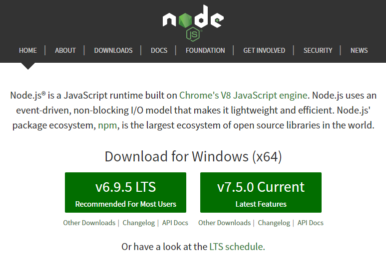
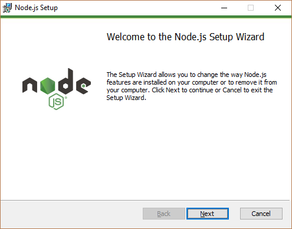
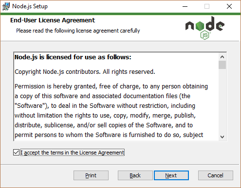
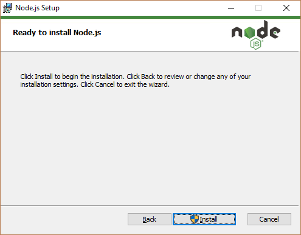
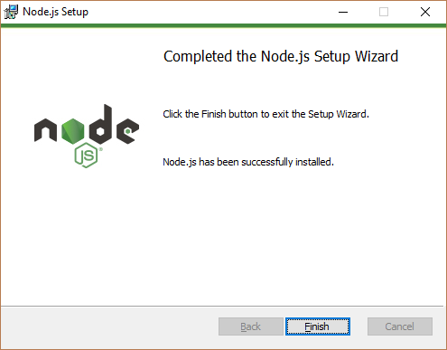
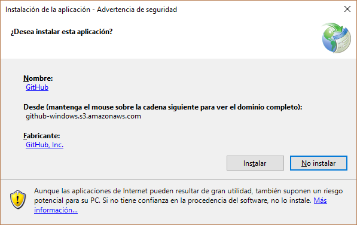
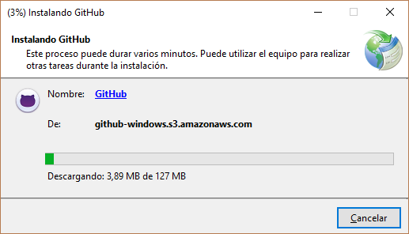
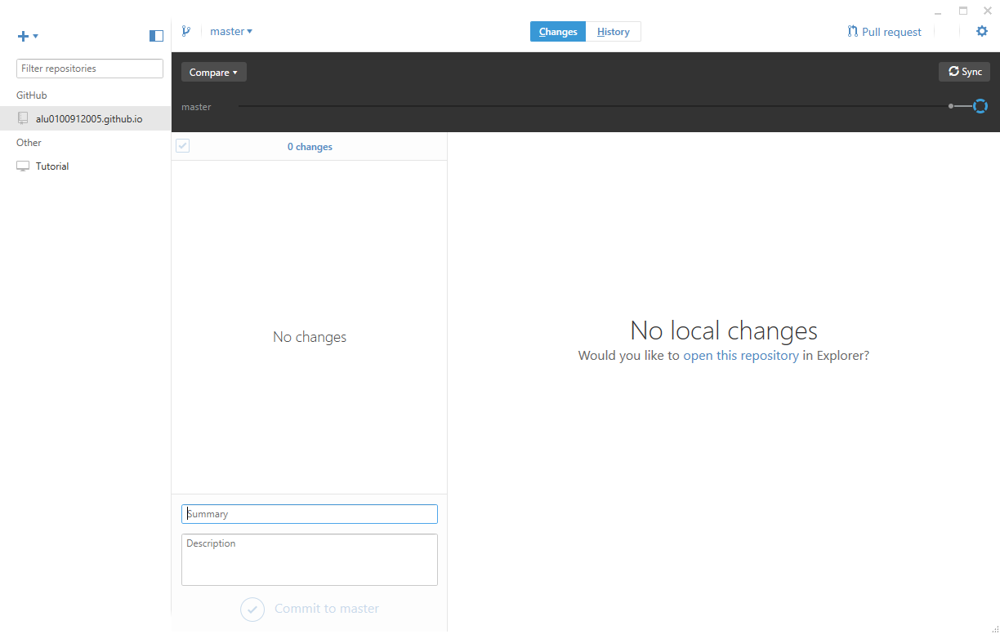
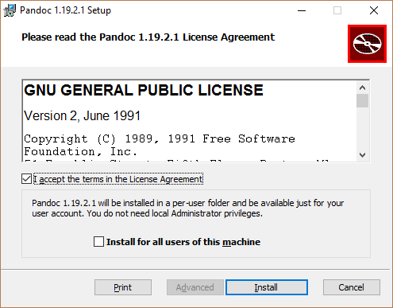
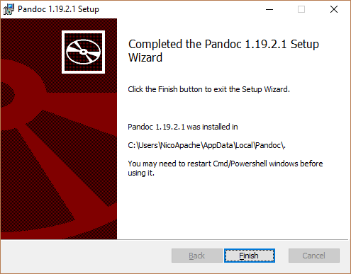

#Chapter 3: Instalación
##Menu
* [Introducción](dsi.html)
* [Chapter 1](dsi_chapter1.html)
* [Chapter 2](dsi_chapter2.html)  
* [Chapter 3](dsi_chapter3.html)  
  
##NodeJS
Vamos a [https://nodejs.org/en/#download](https://nodejs.org/en/#download) y nos descargamos la versión compatible con nuestra máquina  

  

El lanzador del pograma nos da la bienvenida:  

  

Aceptamos los términos de uso:    

  

Aplicamos la configuración que prefiramos y le damos a Install  

  

Completamos la instalación:  

  

##GitHub
Vamos a [https://desktop.github.com/](https://desktop.github.com/) y nos descargamos la versión compatible con nuestra máquina

  

  

Y listo, si queremos cambiar algo de la configuración de instalación debemos ir a Opciones y cambiarlo:  

  

##Pandoc
Vamos a [https://github.com/jgm/pandoc/releases/tag/1.19.2.1](https://github.com/jgm/pandoc/releases/tag/1.19.2.1) y nos descargamos la versión compatible con nuestra máquina:  

  

Finalizamos la instalacion:  

  
